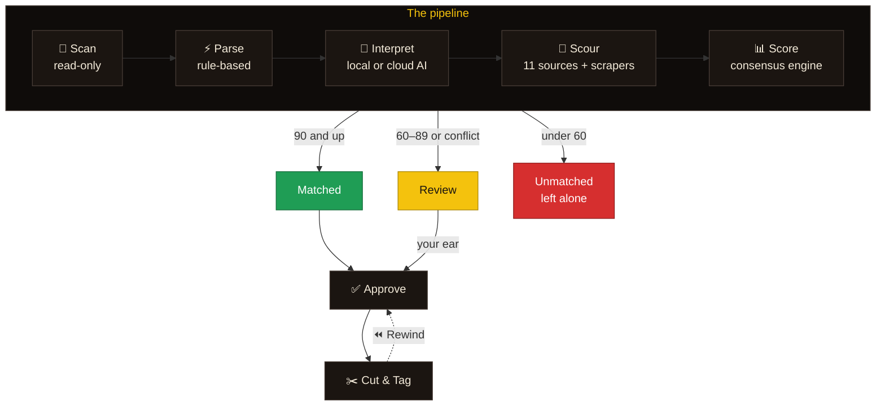

<p align="center">
  
</p>

<p align="center">
  
  
  
  
  <br>
  
  
  
</p>

<p align="center">
  <b>Wheel up the badly named rips.</b><br>
  Dubplate reads your filenames like a selector would, checks what it hears against the big databases and the underground archives,<br>
  and only renames a tune to <code>Artist - Title</code> when the sources agree. Everything else waits for your ear.
</p>

<p align="center">
  <a href="#quick-start">Quick start</a> ·
  <a href="#docker">Docker</a> ·
  <a href="#how-it-works">How it works</a> ·
  <a href="#sources">Sources</a> ·
  <a href="#ai-providers">AI providers</a> ·
  <a href="#configuration">Configuration</a> ·
  <a href="#glossary">Glossary</a>
</p>


## 🔊 Wha' gwaan?

Every collection has them: tunes pulled off pirate radio, CD-Rs, forum
rips and old hard drives, named any way at all. Dubplate turns this…

```text
12_buju_banton_vs_beenie_man_live_93_dubplate.mp3
03. Wiley - Wot Do U Call It (Official Video) [320kbps] www.grimeripz.com.mp3
A1-Tenor_Saw-Ring_The_Alarm.mp3
chronixx ft protoje - here comes trouble (dubplate for king addies).mp3
Murder She Wrote - Chaka Demus & Pliers.mp3
audio_track_01 copy.mp3
```

…into this, and shows its working for every call:

| | Becomes | Confidence | Why |
| :-: | --- | :-: | --- |
| 🟩 | `Wiley - Wot Do U Call It.mp3` | **93** | Clean reading, and independent sources agree |
| 🟩 | `Tenor Saw - Ring the Alarm.mp3` | **93** | Vinyl side `A1` stripped; the catalogues confirm it |
| 🟨 | `Chronixx feat. Protoje - Here Comes Trouble (Dubplate for King Addies).mp3` | **85** | The song is confirmed, but this cut is a dubplate |
| 🟨 | `Chaka Demus & Pliers - Murder She Wrote.mp3` | **85** | The filename had the title first. The swap was spotted, but you get the final say |
| 🟨 | `Buju Banton vs Beenie Man - Live Clash (Dubplate).mp3` | **75** | A clash tape that no database lists, so it's capped for review |
| 🟥 | *(left alone)* | **6** | Nothing to go on, so nothing gets touched |

<sub>From a run over the demo library (`npm run demo`). Real scores depend on which sources know the tune.</sub>


<a id="how-it-works"></a>

## 🎛️ The riddim: how it works



| Stage | What happens |
| --- | --- |
| **📂 Scanner** | Walks your folders and reads existing tags, duration and a content fingerprint into a SQLite staging database. **It never opens a music file for writing.** It follows files you've moved and flags exact duplicates. |
| **⚡ Rule-based parser** | A fast first pass. It strips rip-site names, bitrates, *(Official Video)*, and track and vinyl-side numbers. It splits `Artist - Title`, `Title by Artist` and `A vs B` clashes, and spots hints like *dubplate*, *special*, *live '93*, *riddim* and *VIP*. |
| **🧠 AI interpreter** | Reads the filename, folder, tags and first-pass result, and returns structured JSON: artists, `&` or `vs`, title, version, year, riddim, event, alternatives and search queries. Your approvals are shown to it as examples, so it learns your style. |
| **🔎 Metadata scourer** | Asks every enabled source at once, with polite per-host rate limits and a 7-day response cache. |
| **📊 Confidence engine** | Groups the hits by recording, then weighs consensus across independent sources, agreement between readings, duration, fingerprint matches and conflicts. The result is an explainable 0–100 score. |
| **✂️ Verify & execute** | Bulk-approve the matches, review the rest, then rename and tag in place. Every operation is logged so any batch can be put back. |

### 📊 Reading the meter

The colours mean the same thing everywhere in the app:

| | Band | What happens |
| :-: | --- | --- |
| 🟩 | **90–100: Matched** | Strong consensus. Ready to approve, or auto-approve if you turn that on. |
| 🟨 | **60–89: Review** | Plausible but unproven, *or* strong sources disagree. It goes to the review queue. |
| 🟥 | **0–59: Unmatched** | Guesswork. Never touched unless you step in. |

The **Evidence** tab shows every factor behind a score:

- **Readings agree**: the AI, the parser and the embedded tags agree with each other.
- **AI certainty**: how sure the model says it is.
- **Sources match the reading**: how close the best hit is to what the file says.
- **Source consensus**: how many independent sources back the same recording, weighted by trust.
- **Conflicts** pull the score down. **Duration** and an **AcoustID fingerprint** can nudge it up or down.

> [!NOTE]
> A reading that **no source confirms** is capped at 75, so dubplates and
> specials that exist nowhere online always get a human check. Thresholds and
> source weights are all adjustable in Settings.


## 📸 Inna di dance

<table>
  <tr>
    <td width="50%"><p align="center"><b>The yard</b>: where your crates stand</p></td>
    <td width="50%"><p align="center"><b>Track detail</b>: evidence, audio preview and editor</p></td>
  </tr>
  <tr>
    <td><p align="center"><b>Selector's chair</b>: keyboard-driven review</p></td>
    <td><p align="center"><b>Cut & Tag</b>: plan, dry run, rewind</p></td>
  </tr>
  <tr>
    <td><p align="center"><b>Untangler</b>: test any filename</p></td>
    <td><p align="center"><b>The scourer</b>: sources, keys and trust weights</p></td>
  </tr>
  <tr>
    <td><p align="center"><b>Daytime</b>: light theme</p></td>
    <td align="center"><p align="center"><b>Pocket</b>: works on a phone</p></td>
  </tr>
</table>


<a id="sources"></a>

## 🗂️ Sources

**Big catalogues**

| Source | Key | Notes |
| --- | :-: | --- |
| MusicBrainz | – | The most authoritative source. 1 request per second. |
| Discogs | token | Opens the matching release to find the actual track. Strong for 7″s and white labels. |
| Apple Music (iTunes Search) | – | |
| Deezer | – | Includes durations |
| Spotify | ID + secret | Client-credentials flow |
| Last.fm | key | Crowd-sourced, so weighted lower |

**Underground & archives**

| Source | Key | Notes |
| --- | :-: | --- |
| Bandcamp | – | Independent dub, grime and sound-system releases |
| Internet Archive | – | Clash tapes and pirate radio sets |
| Mixcloud | – | Radio shows and clash recordings |
| YouTube | key | Where most specials end up. Uses auto-generated "Artist - Topic" channels when available. |
| AcoustID | key + `fpcalc` | **Audio fingerprinting**: identifies the audio itself, not the name |

**🔧 Custom scrapers**: point Dubplate at any specialist site's search page
(CSS selectors) or JSON API (dot-paths, e.g. WordPress `/wp-json`). Grime
archives, clash databases and label shops all work. The built-in **Test**
button shows exactly what gets extracted. Presets for Juno Download and a
sound-clash archive ship switched off until you've verified them.

<a id="ai-providers"></a>

## 🧠 AI providers

| Provider | Default model | Notes |
| --- | --- | --- |
| 🏠 **Ollama (local)** | `qwen3:8b` | Structured JSON output via `format`. Everything stays on your machine. |
| ☁️ Ollama Cloud | `gpt-oss:120b` | `https://ollama.com` plus an API key |
| OpenAI | `gpt-5-mini` | Strict JSON-schema responses |
| Anthropic | `claude-haiku-4-5` | Forced tool call for structured output |
| Command Code | pick from list | OpenAI-compatible Provider API at `https://api.commandcode.ai/provider/v1` |
| OpenAI-compatible | – | LM Studio, OpenRouter, Groq, vLLM and others. Falls back from JSON-schema to JSON mode to plain instructions. |

Try any filename against the parser and the active model in the
**Untangler**. It doesn't touch your library.


<a id="quick-start"></a>

## ▶️ Run the dance: quick start

Needs **Node.js 22.13+** (Dubplate uses the built-in `node:sqlite`).

```bash
npm install
npm run build
npm start               # → http://127.0.0.1:4455
```

Development mode, with the API on :4455 and Vite on :5173 with hot reload:

```bash
npm run dev
```

> [!TIP]
> No music handy? `npm run demo -- ./demo-crates` makes a folder of silent
> files with realistically messy names.

**First session**

1. **Libraries**: add a folder. It's scanned read-only.
2. **Settings → AI interpreter**: pick a provider and model, then hit **Test**.
3. **Dashboard → Process new**: interpret → scour → score.
4. **Review**: listen, check the evidence, fix anything that's off and approve.
5. **Cut & Tag**: do a dry run, switch off read-only mode, then cut. **Rewind** undoes any batch.

**Keyboard**

| Keys | Where | Does |
| --- | --- | --- |
| <kbd>⌘</kbd> <kbd>K</kbd> / <kbd>Ctrl</kbd> <kbd>K</kbd> | anywhere | Command palette |
| <kbd>J</kbd> / <kbd>K</kbd> | Review | Next / previous track |
| <kbd>A</kbd> | Review | Approve (and learn) |
| <kbd>X</kbd> | Review | Leave as-is |

<a id="docker"></a>

## 🐳 Container ting: Docker

```bash
cp .env.example .env        # set MUSIC_DIR, PUID/PGID and keys (all optional)
docker compose up -d        # → http://localhost:4455
```

- 🎵 Your music is mounted at **`/music`**. Add libraries in the app as `/music/…`.
- 💾 The staging database lives in the `dubplate-data` volume (`/data`).
- 👤 The container runs as `PUID:PGID` (default `1000:1000`). That user needs write access to your music for renames to work.
- 🔍 `fpcalc` (Chromaprint) is bundled for AcoustID. Build with `--build-arg WITH_FPCALC=0` to leave it out.
- 🧠 **Ollama on the host** is reached at `host.docker.internal:11434` by default. To run Ollama in the stack instead:

  ```bash
  OLLAMA_BASE_URL=http://ollama:11434 docker compose --profile ollama up -d
  docker compose exec ollama ollama pull qwen3:8b
  ```

- 🌐 If you browse to it by a LAN name or IP (e.g. a NAS), add that name or IP to `DUBPLATE_ALLOWED_HOSTS`.


<a id="configuration"></a>

## 🎚️ Mixing desk: configuration

Everything is editable in the UI. Environment variables set defaults and
secrets, and keys entered in the UI take precedence.

<details>
<summary><b>Environment variables</b></summary>

| Variable | Default | |
| --- | --- | --- |
| `DUBPLATE_PORT` | `4455` | |
| `DUBPLATE_HOST` | `127.0.0.1` | `0.0.0.0` in Docker |
| `DUBPLATE_DATA_DIR` | `~/.dubplate` | SQLite database + response cache |
| `DUBPLATE_ALLOWED_HOSTS` | – | Extra `Host` names allowed (DNS-rebinding guard); `*` disables the check |
| `OLLAMA_BASE_URL`, `OLLAMA_MODEL` | `http://localhost:11434`, `qwen3:8b` | |
| `OPENAI_API_KEY`, `ANTHROPIC_API_KEY`, `OLLAMA_API_KEY`, `COMMANDCODE_API_KEY`, `OPENAI_COMPATIBLE_API_KEY` | – | |
| `DISCOGS_TOKEN`, `LASTFM_API_KEY`, `SPOTIFY_CLIENT_ID`, `SPOTIFY_CLIENT_SECRET`, `YOUTUBE_API_KEY`, `ACOUSTID_API_KEY` | – | |
| `FPCALC_PATH` | `fpcalc` on `PATH` | |

</details>

<details>
<summary><b>Naming & tagging</b></summary>

The default template is `{artist} - {title}`. The available tokens are
`{artist}`, `{title}`, `{song}` (the title without the version),
`{version}`, `{year}`, `{album}`, `{label}`, `{featuring}` and `{genre}`.

- Clashes are joined with ` vs `, collaborations with ` & `, and three or more names become `A, B & C`.
- Featured artists go in the artist (`A feat. B - Title`) or the title (`A - Title (feat. B)`), as you prefer.
- Characters that filesystems reject are replaced. Names that would collide are **blocked, never overwritten**.

Tags are written with
[node-taglib-sharp](https://github.com/benrr101/node-taglib-sharp), so MP3,
FLAC, M4A, OGG/Opus, WAV, AIFF, WMA and APE are all supported. Artist and
title are always written. Album, year, genre and label only fill fields that
are empty.

</details>

## 🛡️ Safety inna di dance

- 🔒 **Read-only by default.** Nothing on disk changes until you turn off read-only mode.
- 👀 Scans only stat, list and read.
- 🧾 Before writing, Dubplate checks that each file still has the size and mtime from the scan.
- 🚫 Renames stay in the same folder and never overwrite another file.
- ⏪ Every rename and tag write is logged with the old name and tag values, so **Rewind** restores both.
- 🏠 The server binds to localhost, rejects unknown `Host` headers (DNS rebinding) and needs an `X-Dubplate` header on every write request (CSRF).

## 🎁 Extra riddims

- 🧠 **Learning**: approvals become examples for the AI, and an alias table maps shorthand to credited names (`buju` → Buju Banton, `kartel` → Vybz Kartel).
- 🎧 **Audio preview** in the review screen, with streaming and seeking.
- 👯 **Duplicates**: identical audio by fingerprint, plus different files that would get the same name.
- 📟 **Live console**: job progress and logs streamed over server-sent events.
- 📤 **Export** CSV or JSON reports for any filter.
- ⌨️ **Command palette**, and light and dark themes.


<a id="glossary"></a>

## 📖 Selector's glossary

The app borrows from sound-system culture. Here's what the words mean, both
in the dance and in Dubplate:

| Word | In the dance | In Dubplate |
| --- | --- | --- |
| **Dubplate** | A one-off acetate cut of a tune, often voiced exclusively for one sound | The app, and a *version* it keeps in the title, e.g. `(Dubplate)` |
| **Special** | A dubplate with the lyrics changed to big up a particular sound | Detected as a version; capped for review, since no database lists it |
| **Selector** | The one choosing the tunes | You, in the review queue |
| **Riddim** | The instrumental a tune is voiced on | Picked out by the AI (`Sleng Teng`, `Diwali`…) |
| **Clash** | Sound systems going head to head | `A vs B` readings, joined with ` vs ` |
| **Pull up / Rewind** | Stopping the tune to run it back from the top | **Rewind** puts a batch back exactly as it was |
| **Crates** | A selector's record boxes | Your libraries |
| **Big up** | Respect, a shout-out | What the success toasts say |

## 🔧 Development

```bash
npm test            # vitest: parser, confidence engine, naming, sources, scan→cut→rewind on real files
npm run typecheck
npm run lint
```

```text
server/
  core/          filename parser, normaliser, confidence engine, naming (pure, shared with the UI)
  ai/            LLM providers + interpreter prompt
  sources/       MusicBrainz, Discogs, … + declarative scrapers, rate-limited cached HTTP
  scanner.ts     read-only library walker
  pipeline.ts    interpret → scour → score
  executor.ts    plan / rename + tag / rewind
  app.ts         Hono API + SSE
shared/types.ts  types used by server and UI
src/             React + Vite UI (shadcn/ui, Base UI)
docs/            banner, screenshots
```

### 🎨 The look

Built with Vite, React 19, Tailwind v4 and **shadcn/ui preset
[`b6FArvVnDX`](https://ui.shadcn.com)**: Base UI primitives, the *Luma*
style, a taupe base with a red theme, Hugeicons, Geist and Manrope, a large
radius and inverted-translucent menus. The palette is re-tuned for a roots
feel: warm yard neutrals, **red** as the primary, and **gold** and **green**
as first-class tokens. The chart colours are validated for colour-blind
separation in both themes. `components.json` is set up for the preset, so
`npx shadcn@latest add <component>` works as normal.

<br>


<p align="center">
  <b>Big up every selector, soundman, engineer and archivist keeping the culture alive.</b><br>
  <sub>Made for the crates. One love. 🟥🟨🟩</sub>
</p>
