<p align="center">
  
</p>

<p align="center">
  
  
  
  
  <br>
  
  <a href="https://github.com/sshahs/dubplate/pkgs/container/dubplate"></a>
  
</p>

<p align="center">
  <b>Wheel up the badly named rips.</b><br>
  Dubplate reads your filenames like a selector would, checks what it hears against the big databases and the underground archives,<br>
  and only renames a tune to <code>Artist - Title</code> when the sources agree. Everything else waits for your ear.
</p>

<p align="center">
  <a href="#quick-start">Quick start</a> ·
  <a href="#docker">Docker</a> ·
  <a href="#how-it-works">How it works</a> ·
  <a href="#sources">Sources</a> ·
  <a href="#ai-providers">AI providers</a> ·
  <a href="#configuration">Configuration</a> ·
  <a href="#glossary">Glossary</a>
</p>


## 🔊 Wha' gwaan?

Every collection has them: tunes pulled off pirate radio, CD-Rs, forum
rips and old hard drives, named any way at all. Dubplate turns this…

```text
12_buju_banton_vs_beenie_man_live_93_dubplate.mp3
03. Wiley - Wot Do U Call It (Official Video) [320kbps] www.grimeripz.com.mp3
A1-Tenor_Saw-Ring_The_Alarm.mp3
chronixx ft protoje - here comes trouble (dubplate for king addies).mp3
Murder She Wrote - Chaka Demus & Pliers.mp3
audio_track_01 copy.mp3
```

…into this, and shows its working for every call:

| | Becomes | Confidence | Why |
| :-: | --- | :-: | --- |
| 🟩 | `Wiley - Wot Do U Call It.mp3` | **93** | Clean reading, and independent sources agree |
| 🟩 | `Tenor Saw - Ring the Alarm.mp3` | **93** | Vinyl side `A1` stripped; the catalogues confirm it |
| 🟨 | `Chronixx feat. Protoje - Here Comes Trouble (Dubplate for King Addies).mp3` | **85** | The song is confirmed, but this cut is a dubplate |
| 🟨 | `Chaka Demus & Pliers - Murder She Wrote.mp3` | **85** | The filename had the title first. The swap was spotted, but you get the final say |
| 🟨 | `Buju Banton vs Beenie Man - Live Clash (Dubplate).mp3` | **75** | A clash tape that no database lists, so it's capped for review |
| 🟥 | *(left alone)* | **6** | Nothing to go on, so nothing gets touched |

<sub>From a run over the demo library (`npm run demo`). Real scores depend on which sources know the tune.</sub>


<a id="how-it-works"></a>

## 🎛️ The riddim: how it works

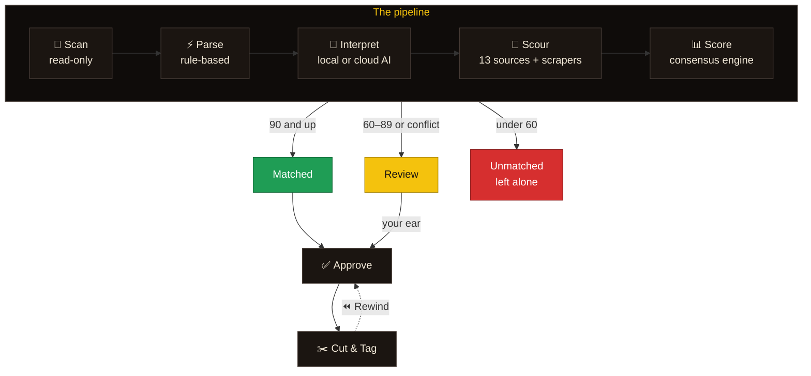

| Stage | What happens |
| --- | --- |
| **📂 Scanner** | Walks your folders and reads existing tags (including BPM, key and cover art), duration and a content fingerprint into a SQLite staging database. **It never opens a music file for writing.** It follows files you've moved and flags exact duplicates, and keeps each file's name, place and tags as first found, never changed afterwards. Watched folders are picked up as files land. |
| **⚡ Rule-based parser** | A fast first pass. It strips rip-site names, bitrates, *(Official Video)*, and track and vinyl-side numbers. It splits `Artist - Title`, `Title by Artist` and `A vs B` clashes, and spots hints like *dubplate*, *special*, *live '93* and *VIP*. A riddim is never the artist: `Seasons Riddim - Gyptian - Is There A Place`, `Title (Seasons Riddim)`, a `Seasons Riddim (2009)` or `Riddims/Seasons` folder and a riddim album tag all give the riddim. |
| **🧠 AI interpreter** | Reads the filename, folder, tags and first-pass result, and returns structured JSON: artists, `&` or `vs`, title, version, year, riddim, event, alternatives and search queries. Your approvals are shown to it as examples, so it learns your style, and a written rulebook keeps it from inventing what the sources didn't say. An optional bigger model gives a **second opinion** on the uncertain ones. |
| **🔎 Metadata scourer** | With AcoustID set up, the audio fingerprint goes first: a sure fingerprint match skips the AI altogether. Then it asks every enabled source at once, with polite per-host rate limits, a 7-day response cache and a two-week cache of lookups by artist, title, version and length (so a renamed copy doesn't ask again). |
| **🧹 Field checks** | Every reading, AI answer, source hit, decision and edit goes through the same checks, so each field holds only its own thing (see **Field checks** below). What's plainly in the wrong place is put right; what isn't keeps the track out of auto-approve and hands-off. |
| **📊 Confidence engine** | Groups the hits by recording, then weighs consensus across independent sources, agreement between readings, duration, fingerprint matches and conflicts. The result is an explainable 0–100 score, plus which **release** the track belongs to (the artist's own album, EP or single before a compilation or DJ mix) and a separate **risk** rating for letting automation change the file. |
| **🎨 Artwork, tempo & key** | Fetches a cover from the sources that confirmed the track (Cover Art Archive, Discogs, Bandcamp, Apple Music, Deezer…), and listens to the audio for BPM and musical key. |
| **✂️ Verify & execute** | Bulk-approve the matches, review the rest, then rename and tag in place, writing MusicBrainz and Discogs IDs where the sources found them. Every operation is logged so any batch can be put back. |
| **🗄️ Organise** | Optionally moves cut tracks into a folder layout of your choosing inside the library (`Artist / Year - Album`, `A-Z / Artist`, `BPM / Key`…), bringing cover images along and tidying empty folders. Previewed as a tree first, rewindable after. |

### 📊 Reading the meter

The colours mean the same thing everywhere in the app:

| | Band | What happens |
| :-: | --- | --- |
| 🟩 | **90–100: Matched** | Strong consensus. Ready to approve, or auto-approve if you turn that on. |
| 🟨 | **60–89: Review** | Plausible but unproven, *or* strong sources disagree. It goes to the review queue. |
| 🟥 | **0–59: Unmatched** | Guesswork. Never touched unless you step in. |

The **Evidence** tab shows every factor behind a score:

- **Readings agree**: the AI, the parser and the embedded tags agree with each other.
- **AI certainty**: how sure the model says it is.
- **Sources match the reading**: how close the best hit is to what the file says.
- **Source consensus**: how many independent sources back the same recording, weighted by trust.
- **Conflicts** pull the score down. **Duration** and an **AcoustID fingerprint** can nudge it up or down.

> [!NOTE]
> A reading that **no source confirms** is capped at 75, so dubplates and
> specials that exist nowhere online always get a human check. Thresholds and
> source weights are all adjustable in Settings.

The **Decision** tab answers each question on its own, in order, so a sure
recording on a doubtful release says exactly that:

1. **Recording**: which song, and how many independent sources back it (Discogs and your Discogs collection count once).
2. **Release**: which album, EP, single, compilation or DJ mix it's tagged with, and why.
3. **Version**: original, remix, VIP, dubplate, live, edit…, with whether the length and fingerprint fit.
4. **Genre**: the canonical genre, when that's on.
5. **Safe to automate**: the risk (below).
6. **Verified**: approved by you, by auto-approve or by hands-off.
7. **AcoustID** and **MusicBrainz**: whether its fingerprint can be sent back, and whether MusicBrainz knows the release.

It also shows where each field came from (MusicBrainz, Discogs, the AI, the file's tags…).

**Risk is not confidence.** A 92 that one source backs up, on a file that's
cut short, is a confident guess but a risky write. A track is **high risk**
when a second opinion was needed, sources conflict, only the AI's reading
stands, the fingerprint points elsewhere or the file is damaged; **some risk**
with fewer than two independent sources, a length that doesn't fit, a
suspect quality or an extension to fix. **Auto-approve and hands-off only act
on low-risk tracks**; everything else waits for a person.


## 📸 Inna di dance

<table>
  <tr>
    <td width="50%">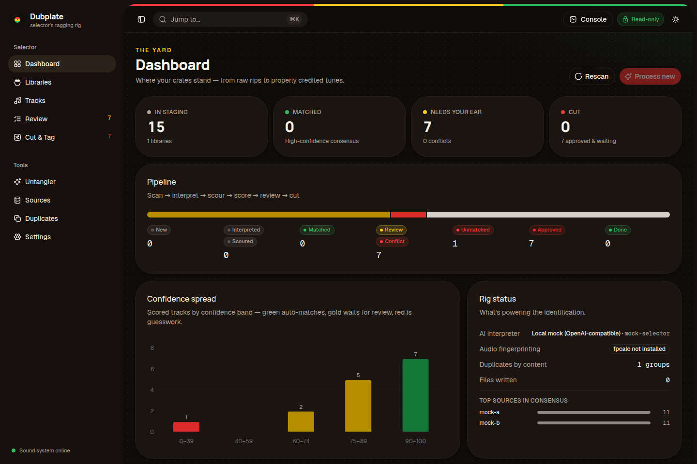<p align="center"><b>The yard</b>: where your crates stand</p></td>
    <td width="50%">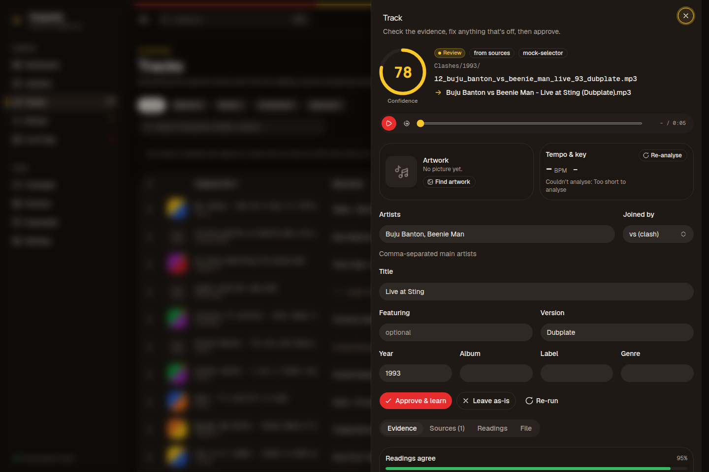<p align="center"><b>Track detail</b>: evidence, audio preview and editor</p></td>
  </tr>
  <tr>
    <td>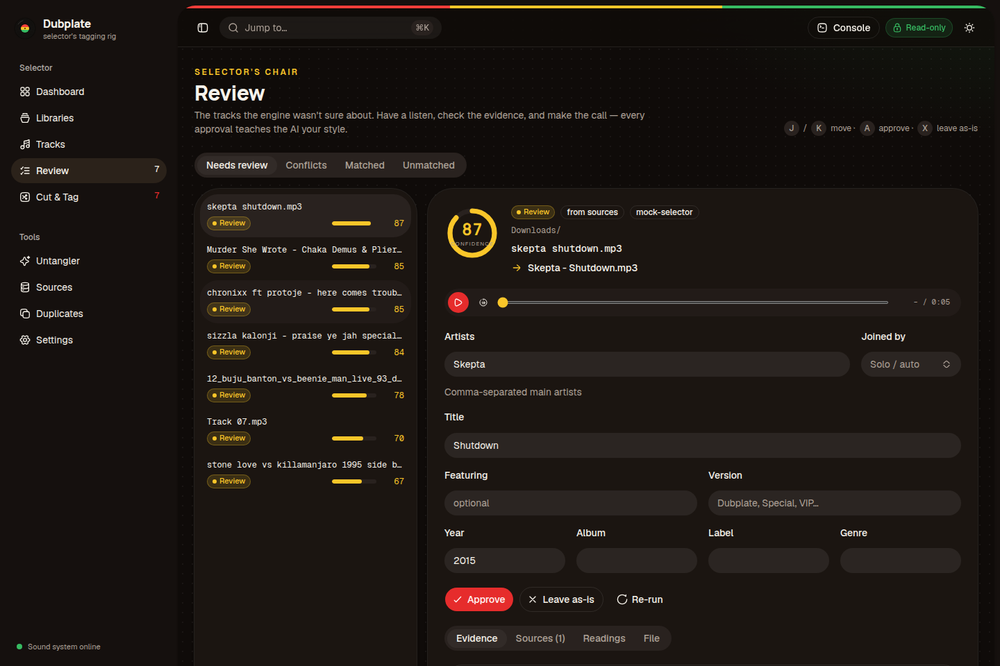<p align="center"><b>Selector's chair</b>: keyboard-driven review</p></td>
    <td>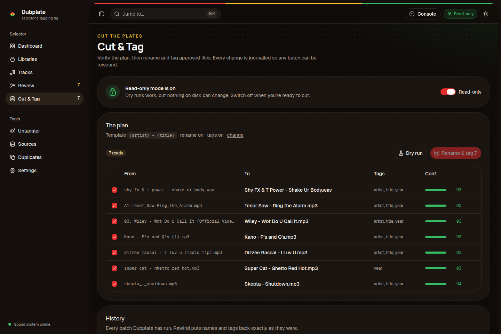<p align="center"><b>Cut & Tag</b>: plan, dry run, rewind</p></td>
  </tr>
  <tr>
    <td>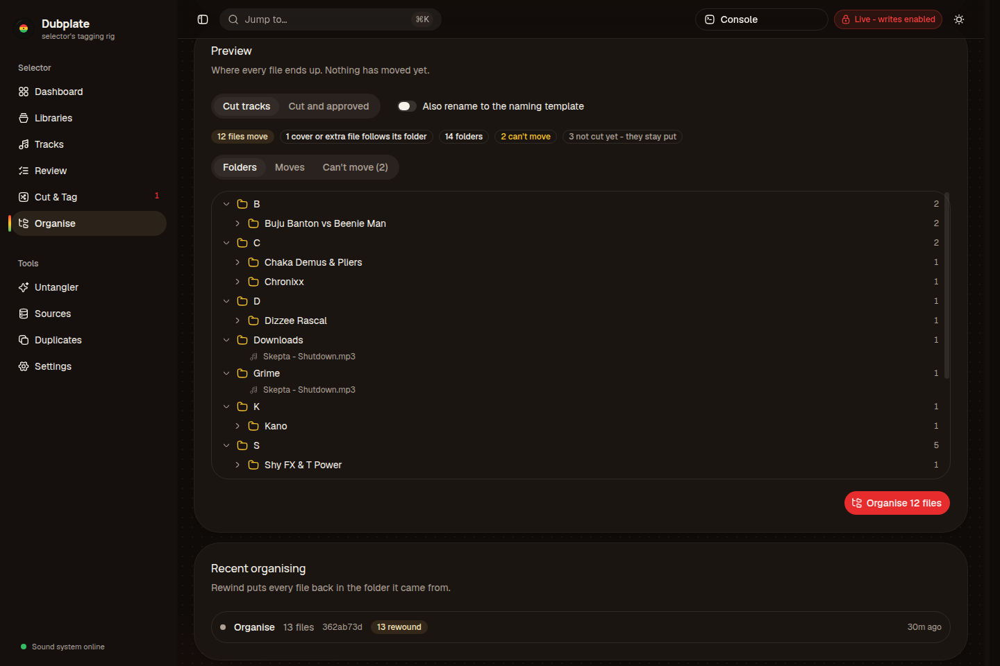<p align="center"><b>Shelve the crates</b>: see every folder before a file moves</p></td>
    <td>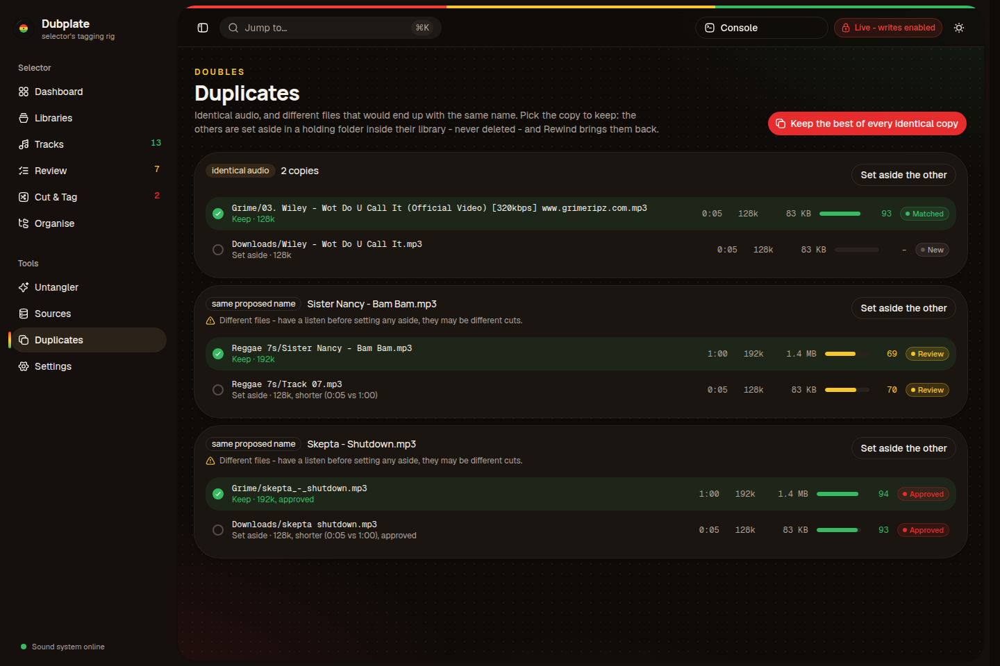<p align="center"><b>Doubles</b>: keep the best copy, set the rest aside</p></td>
  </tr>
  <tr>
    <td>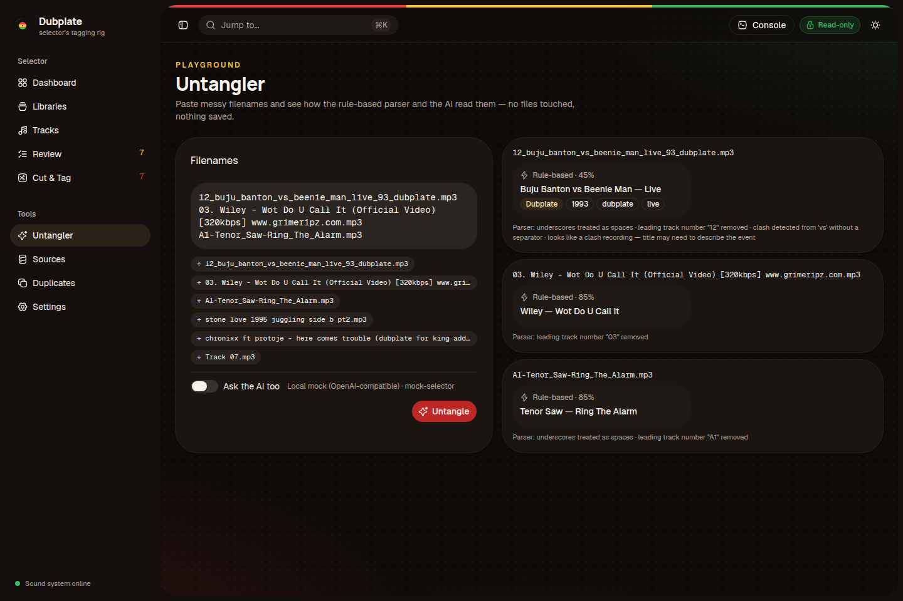<p align="center"><b>Untangler</b>: test any filename</p></td>
    <td>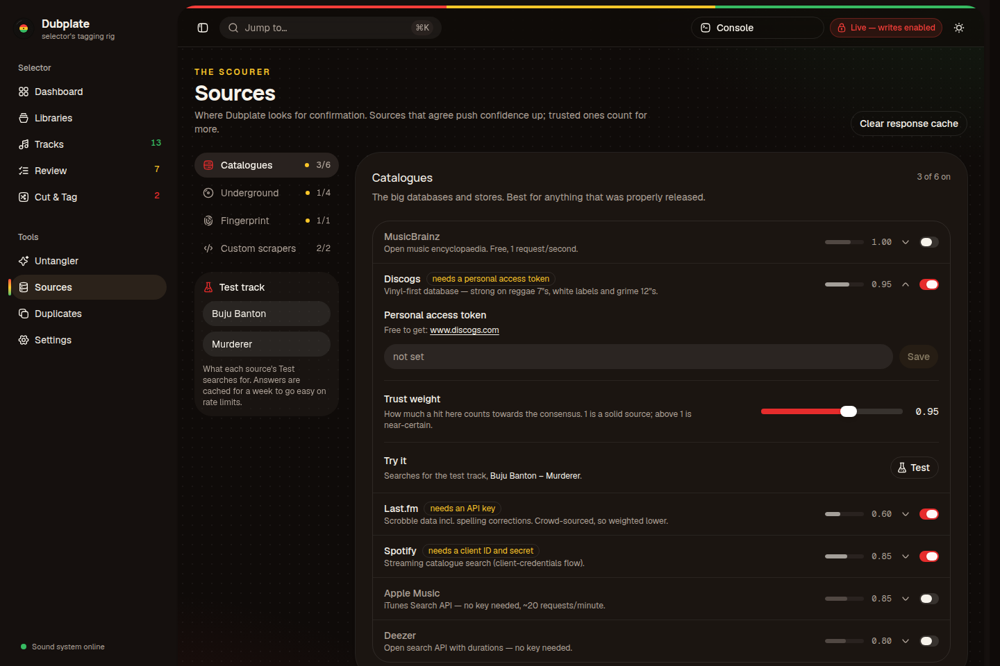<p align="center"><b>The scourer</b>: sources grouped by where they look, with keys and trust weights</p></td>
  </tr>
  <tr>
    <td>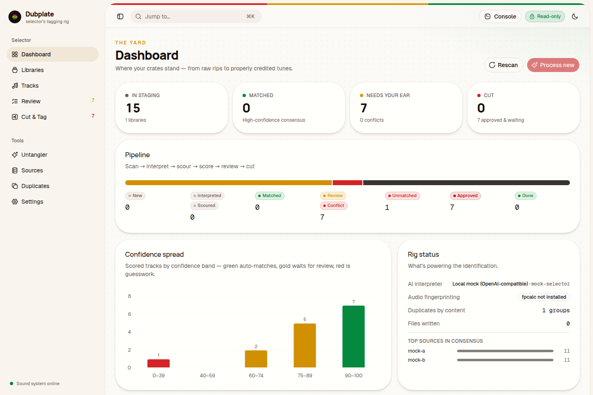<p align="center"><b>Daytime</b>: light theme</p></td>
    <td align="center">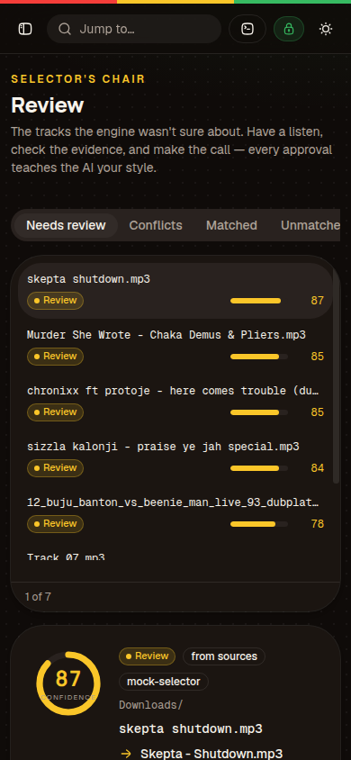<p align="center"><b>Pocket</b>: works on a phone</p></td>
  </tr>
</table>


<a id="sources"></a>

## 🗂️ Sources

**Big catalogues**

| Source | Key | Notes |
| --- | :-: | --- |
| MusicBrainz | – | The most authoritative source. 1 request per second. |
| Discogs | token | Opens the matching release to find the actual track. Strong for 7″s and white labels. |
| Apple Music (iTunes Search) | – | |
| Deezer | – | Includes durations |
| Spotify | ID + secret | Client-credentials flow |
| Last.fm | key | Crowd-sourced, so weighted lower |
| Your Discogs collection | token | The records you own. **Sources → Sync** pulls your collection down; a track that matches one of your releases counts ×1.2. Ideal for vinyl rips. |

**Underground & archives**

| Source | Key | Notes |
| --- | :-: | --- |
| Bandcamp | – | Independent dub, grime and sound-system releases |
| Internet Archive | – | Clash tapes and pirate radio sets |
| Mixcloud | – | Radio shows and clash recordings |
| Who Cork The Dance | – | The dancehall sound system tape archive at whocorkthedance.com: sessions from Killamanjaro, Volcano, Jammys, Stereophonic, Gemini and dozens more from 1979 on, read once a month (the site has no search). A tape downloaded from there is recognised by its file name, even with the archive's numbering and credits ("killamanjaro vs stone love 1989keithjaymandrew.mp3"); a renamed one by its sounds and year. |
| SoundClash Hub sounds | – | Each sound system's page of featured clash recordings (mostly soundtape.com tapes on SoundCloud). A clash tape whose sounds have a page - Killamanjaro, Stone Love, King Addies, Saxon and 35 more - is checked against them by the sounds and the year. |
| YouTube | key | Where most specials end up. Uses auto-generated "Artist - Topic" channels when available. |
| AcoustID | key + `fpcalc` | **Audio fingerprinting**: identifies the audio itself, not the name |

**Riddims & rave**

| Source | Key | Notes |
| --- | :-: | --- |
| Riddimguide | – | 58,000 reggae and dancehall tunes with the riddim each is voiced on, its label and year. Asked for the song by name; only the track's own artists' rows count, so "Ring The Alarm" means Tenor Saw's, not a dozen others. |
| Riddim-ID | – | Riddim, label and year for reggae, dancehall and soca tunes from the 1960s on. |
| Reggae Fever | – | The Swiss reggae shop's 66,000-record catalogue: A and B sides with riddim, label, year and pressing country (GB, JM, US). Strong on original UK and JA 7″s and 12″s. |
| Riddims World | – | 24,000 riddims with their tracklists. Its search only knows riddim names, so it checks a riddim the AI reads in the file name and adds the label and year when the tune is on it. |
| Rave Tape Packs | – | Jungle, hardcore, drum & bass and UK garage tape packs with their DJs, MCs and year. A set matches when its DJ or MC is on the pack. |
| Rave Archive UK | – | Raves from 1988 on, with venues, dates and the recordings that survive. A set matches when its DJ is named on the night. |
| MixesDB | – | DJ mixes and radio shows: who played, which show or club, and the date. Only the artist's own sets count, not mixes that played their tunes. |
| junglist.co.uk | – | Rare jungle and drum & bass tracks, dubplates and whitelabels as the community names them. |

A tune a riddim database knows gets its riddim: the track page shows "On the
Stalag riddim" under the new name, each source hit lists the riddim it gave,
and cutting writes it to the file (see Naming & tagging). Not added, because there's nothing a program can read: My Soundtapes
(a paid app behind a login), Original Kool Archives (a 24/7 stream with no
list of shows), Jah Troopers' audio archive (one release, on YouTube) and
RollDaBeats (the discography has closed; only the forum is left).

**🔧 Custom scrapers**: point Dubplate at any specialist site's search page
(CSS selectors) or JSON API (dot-paths, e.g. WordPress `/wp-json`). Grime
archives, clash databases and label shops all work, and so do pages that carry
their results as JSON inside them (a `<script>` tag). The built-in **Test**
button shows exactly what gets extracted. Presets ship switched off: Regime
Radio Sound Tapes, Traxsource, Genius, Audius, Hype Machine, Grime Archive,
BritishHipHop.co.uk, SoundClash Hub and SoundCloud answered with real results
when checked in October 2026; Juno Download is untested. SoundCloud reads the
first ten results of its own search, as served to browsers without
JavaScript, so it needs no key: soundtape.com's clash archive lives there. SoundClash Hub's past events are
the recordings: a clash or juggling tape matches its event listing by the
sounds that played and the year (its listings start around 2025). Site markup drifts, so test one before trusting it.

- **Searching**: a scraper asks for the artist and title, and when that finds nothing, for the names alone - site searches want every word to match, so a long clash title often finds nothing where "Killamanjaro Stone Love" finds the tape. Sites that search one name at a time use `{artist1}` in their address.
- **Kept up to date**: when a preset's site changes, an update fixes saved copies nobody edited (and switches off ones whose site can no longer be searched - AllMusic, ReggaeRecord and GRM Daily - with the reason shown). Copies you edited are left alone.
- **Changes count straight away**: a source or scraper switched on during a run is asked from the next track, and re-running up to 10 tracks runs alongside a long run instead of waiting behind it. Tracks identified before a scraper was switched on keep their old answers until asked again: tick them in **Tracks** (or search, filter and **Select all matching**), then **⋯ → Ask the sources again (no AI)**.
- **Genre weights**: a scraper (or any source) can count more for particular genres in your crates, e.g. Regime Radio ×1.3 for sound clashes.
- **Supporting only**: a source like an events listing or a forum can back up a match the others found but never confirms one on its own.
- **Plain text only**: whatever a site sends, names, titles, labels and riddims arrive as plain text, never as a link's markup or `&amp;`. The same goes for what the AI reads and what you type. Tracks identified before this was in place are cleaned once after upgrading; files already cut with markup in their tags are listed in the Console, ready for **Update tags**.
- **Health check**: a site that redesigns or puts search behind a login starts answering with "Login" or its home page. After five junk or failed answers in a row the scraper is switched off, with the reason on the Sources and Health pages; switch it back on once its Test works.

**🎯 Tuned to your crates**: each source knows which genres it's strong for
(Bandcamp for jungle and dub, Mixcloud for DJ mixes and radio rips, the
streaming stores for pop and hip-hop…). When you've picked genres, sources
that suit them count ×1.2, and presets that suit them are flagged as
suggested. A library with its own genres gets its own tuning. Switch it off on
the Sources page.

<a id="ai-providers"></a>

## 🧠 AI providers

| Provider | Default model | Notes |
| --- | --- | --- |
| 🏠 **Ollama (local)** | `qwen3:8b` | Structured JSON output via `format`. Everything stays on your machine. |
| ☁️ Ollama Cloud | `gpt-oss:120b` | `https://ollama.com` plus an API key |
| OpenAI | `gpt-5-mini` | Strict JSON-schema responses |
| Anthropic | `claude-haiku-4-5` | Forced tool call for structured output |
| Command Code | pick from list | OpenAI-compatible Provider API at `https://api.commandcode.ai/provider/v1`. Has a **Zero Data Retention** switch (sends `x-cmd-zdr: 1`); `CMD_ZDR=1` forces it on. |
| OpenAI-compatible | – | LM Studio, OpenRouter, Groq, vLLM and others. Falls back from JSON-schema to JSON mode to plain instructions. |

Try any filename against the parser and the active model in the
**Untangler**. It doesn't touch your library.


<a id="quick-start"></a>

## ▶️ Run the dance: quick start

Needs **Node.js 22.13+** (Dubplate uses the built-in `node:sqlite`).

```bash
npm install
npm run build
npm start               # → http://127.0.0.1:4455
```

Development mode, with the API on :4455 and Vite on :5173 with hot reload:

```bash
npm run dev
```

> [!TIP]
> No music handy? `npm run demo -- ./demo-crates` makes a folder of silent
> files with realistically messy names, plus one exact copy for Duplicates.

**First session**

1. **Welcome checklist**: pick what's in your crates (genres and kinds of recording, or add your own; skip it and Dubplate reads any genre), choose the AI that reads the names and hit **Save & test**, leave a contact email for MusicBrainz, then point it at your first folder. It's scanned read-only and every track is identified straight away.
2. **Review**: listen, check the evidence, fix anything that's off and approve. On a phone, swipe right to approve and left to leave as-is. **Approve all** clears a whole queue at once, with Undo.
3. **Cut & Tag**: do a dry run, switch off read-only mode, then cut. **Rewind** undoes any batch.
4. **Organise** (optional): pick a folder layout, check the preview tree, and move everything into place.

More libraries later: **Libraries → Add library**, then **Dashboard → Process new** (or switch on **Watch for new files** and new rips are identified as they land). **Customise** on a library gives it its own genres, file names or folder layout.

**Keyboard**

| Keys | Where | Does |
| --- | --- | --- |
| <kbd>⌘</kbd> <kbd>K</kbd> / <kbd>Ctrl</kbd> <kbd>K</kbd> | anywhere | Command palette |
| <kbd>⌘</kbd> <kbd>B</kbd> / <kbd>Ctrl</kbd> <kbd>B</kbd> | anywhere | Fold the sidebar to icons and back (remembered) |
| <kbd>J</kbd> / <kbd>K</kbd> | Review | Next / previous track |
| <kbd>A</kbd> | Review | Approve (and learn) |
| <kbd>X</kbd> | Review | Leave as-is |
| <kbd>Z</kbd> | Review | Undo the last approve / leave-as-is |
| Swipe right / left | Review, on a touch screen | Approve / leave as-is |
| <kbd>Shift</kbd>-click | Tracks | Tick every row between two checkboxes |

<a id="docker"></a>

## 🐳 Container ting: Docker

A ready-made image is published to GitHub Container Registry for
**amd64 and arm64**, so it runs on PCs, Macs, NAS boxes and a Raspberry Pi 4/5.
No Node.js or build step needed.

**One command**

```bash
docker run -d --name dubplate --init -p 4455:4455 \
  -v dubplate-data:/data \
  -v /path/to/your/music:/music \
  ghcr.io/sshahs/dubplate:latest
```

Then open **http://localhost:4455** and add libraries as `/music/…`.

**With compose** (recommended: keys, Ollama and updates in one place)

```bash
curl -O https://raw.githubusercontent.com/sshahs/dubplate/main/compose.yaml
curl -o .env https://raw.githubusercontent.com/sshahs/dubplate/main/.env.example
# edit .env: set MUSIC_DIR, PUID/PGID and any API keys (all optional)
docker compose up -d              # → http://localhost:4455
```

Update to the newest build with `docker compose pull && docker compose up -d`.

| Tag | What it is |
| --- | --- |
| `latest` | The newest build of `main` |
| `1.2.3` · `1.2` · `1` | Releases, from `v*` git tags |
| `sha-abc1234` | One exact commit, for pinning or rolling back |

Pick one with `DUBPLATE_TAG` in `.env`.

- 🎵 Your music is mounted at **`/music`**. Add libraries in the app as `/music/…`.
- 💾 The staging database lives in the `dubplate-data` volume (`/data`). Keep it between upgrades.
- 👤 The container runs as `PUID:PGID` (default `1000:1000`). That user needs write access to your music for renames to work. With plain `docker run`, add `--user 1000:1000`.
- 🔍 `fpcalc` (Chromaprint) is bundled, so AcoustID fingerprinting works out of the box.
- 🧠 **Ollama on the host** is reached at `host.docker.internal:11434` by default. To run Ollama in the stack instead:

  ```bash
  OLLAMA_BASE_URL=http://ollama:11434 docker compose --profile ollama up -d
  docker compose exec ollama ollama pull qwen3:8b
  ```

- 🌐 If you browse to it by a LAN name or IP (e.g. a NAS), add that name or IP to `DUBPLATE_ALLOWED_HOSTS`. Download tools in other containers call it with an API token instead, which doesn't need this.
- 🔑 Reachable by others on your network? Set a password in **Settings → Sign-in & safety**, or with `DUBPLATE_PASSWORD`.
- ❤️ A built-in healthcheck reports the container as healthy once the server is up.

<details>
<summary><b>Build the image yourself</b></summary>

From a checkout:

```bash
docker compose -f compose.yaml -f compose.build.yaml up -d --build
# or
docker build -t dubplate .
```

Add `--build-arg WITH_FPCALC=0` to leave out Chromaprint, or
`--build-arg WITH_FFMPEG=0` to leave out ffmpeg (the video converter and
browser previews of WMA, APE and AIFF need it).

Every push to `main` and every `v*` tag is built by
[`.github/workflows/docker-publish.yml`](.github/workflows/docker-publish.yml).
It smoke-tests the image (boots it and checks the API and UI), then publishes
both architectures to `ghcr.io`. Pull requests get the build and smoke test
without publishing.

</details>


<a id="configuration"></a>

## 🎚️ Mixing desk: configuration

Everything is editable in the UI. Environment variables set defaults and
secrets, and keys entered in the UI take precedence.

<details>
<summary><b>Environment variables</b></summary>

| Variable | Default | |
| --- | --- | --- |
| `DUBPLATE_PORT` | `4455` | |
| `DUBPLATE_HOST` | `127.0.0.1` | `0.0.0.0` in Docker |
| `DUBPLATE_DATA_DIR` | `~/.dubplate` | SQLite database + response cache |
| `DUBPLATE_ALLOWED_HOSTS` | – | Extra `Host` names allowed (DNS-rebinding guard); `*` disables the check |
| `DUBPLATE_PASSWORD` | – | Asks for this password in every browser. Set here, it can't be changed or removed in the app. |
| `OLLAMA_BASE_URL`, `OLLAMA_MODEL` | `http://localhost:11434`, `qwen3:8b` | |
| `OPENAI_API_KEY`, `ANTHROPIC_API_KEY`, `OLLAMA_API_KEY`, `COMMANDCODE_API_KEY`, `OPENAI_COMPATIBLE_API_KEY` | – | |
| `CMD_ZDR` | – | `1` or `true` forces Command Code's Zero Data Retention on (the Settings switch is locked) |
| `DISCOGS_TOKEN`, `LASTFM_API_KEY`, `SPOTIFY_CLIENT_ID`, `SPOTIFY_CLIENT_SECRET`, `YOUTUBE_API_KEY`, `ACOUSTID_API_KEY` | – | |
| `FPCALC_PATH` | `fpcalc` on `PATH` | |
| `FFMPEG_PATH`, `FFPROBE_PATH` | `ffmpeg`, `ffprobe` on `PATH` | For the video converter and previews; `ffprobe` is also looked for next to `FFMPEG_PATH` |
| `TZ` | `UTC` | The clock the nightly scan runs by, e.g. `Europe/London` |
| `DUBPLATE_LOG_LEVEL` | `info` | How much of the log the server also prints (what `docker logs` shows): `detail`, `info`, `warn`, `error` or `off`. The Console keeps everything either way. |

</details>

<details>
<summary><b>Field checks</b></summary>

Whoever fills a field in (the filename parser, the AI, a source, the decision or
you in the editor), it's checked before it's used, and checked again on the way
into the file:

| Found | Put right |
| --- | --- |
| `Seasons Riddim` as the artist, in the title, version or in brackets | Moved to **Riddim** (the album `Seasons Riddim` gives the riddim too) |
| The title inside the artist: `Bounty Killer & Baby Cham - Another level` | Artist `Bounty Killer & Baby Cham`; with no title, the rest becomes the title |
| The artist inside the title: `Tenor Saw - Ring The Alarm` as the title | Title `Ring The Alarm` |
| `feat. Max Romeo` inside the artist or title, or a guest named twice | One guest, in **Featuring**: never `feat. Max Romeo feat. Max Romeo` |
| A genre or placeholder as the album or label: `reggae`, `Reggae / Dancehall`, `Unknown Album`, `1999`, a website | Left empty, so the real one fills it; in a file, it's replaced or cleared when cutting |
| `Other`, `(17)` as the genre | Left empty |
| `(Official Video)`, `[HD]`, `320kbps`, `.mp3`, a site name or a track number in a title or artist | Taken out |
| `Unknown Artist`, `Various Artists`, `VA` as an artist | Taken out |
| A year before 1900 or in the future | Left empty |
| A version that says what kind of recording it is (`Dubplate`, `Special`, `Remix`, `Live`, `VIP`…) when nothing about the file says so: not its name, folder or tags, nor a source that matched it | Left out. The AI is never shown a similar file's version unless this file shares it, so one approved dubplate can't make every Asco tune one |
| A source's `(Remix)`, `(Dub)` or `(Extended Version)` on a title the file never mentions | Taken off, unless the audio fingerprint matched that recording |
| A version, year, label, riddim or event the AI gave that the file's name, folder and tags don't state | Left out as it answers, and listed on the track ("The AI's version "Dubplate" left out") |

**The AI's examples.** With *Learn from my corrections* on, the AI is shown
a few of your past approvals of similar files (sharing a word that isn't as
common as "remix" or "dubplate"). They're fenced off in the prompt as context
only, for how you spell and write names, placed before the file it's reading,
and an example's version is shown only when this file states the same kind
of thing. Whatever a model does with them, the code above holds its answer to
what the file states.

What can't be put right (no artist, `Track 01` as the title, an artist that
looks like an artist and a title together, the same text as artist and title)
is shown on the track. It keeps the track out of auto-approve and hands-off, and
a missing or mixed-up artist or title stops it being cut. The editor runs the
same checks as you type: **Put right now** applies them before you save.

After upgrading, every track is checked once in the background. Tracks
whose artist or title changes are asked about again (no AI), approved ones
have their details corrected, and files already cut with details in the
wrong place go back to **Cut & Tag** to be renamed and tagged again. The
Console lists them all.

</details>

<details>
<summary><b>Naming & tagging</b></summary>

The default template is `{artist} - {title}`. The available tokens are
`{artist}`, `{title}`, `{song}` (the title without the version),
`{version}`, `{year}`, `{album}`, `{label}`, `{riddim}`, `{featuring}`, `{genre}`,
`{position}` (a vinyl position like `B2`, or the track number as `05`),
`{track}` and `{disc}` (only on releases with more than one disc). A token
with no value leaves no gap, so `{position} - {artist} - {title}` is just
`Artist - Title` for a file with no position.

- Clashes are joined with ` vs `, collaborations with ` & `, and three or more names become `A, B & C`.
- Featured artists go in the artist (`A feat. B - Title`) or the title (`A - Title (feat. B)`), as you prefer.
- Characters that filesystems reject are replaced. Names that would collide are **blocked, never overwritten**.

Tags are written with
[node-taglib-sharp](https://github.com/benrr101/node-taglib-sharp), so MP3,
FLAC, M4A, OGG/Opus, WAV, AIFF, WMA and APE are all supported. Artist and
title are always written. Album, year, genre, label and riddim only fill
fields that are empty. BPM and key are written too (key as `Am` or Camelot `8A`, your
choice), and a found cover becomes the front cover - other pictures in the
file are left alone, and a file's existing cover is only replaced if you
allow it.

No tag standard has a riddim, so it goes in a field of its own called
`RIDDIM` (a `TXXX` frame in MP3, a Vorbis comment in FLAC and Ogg, an iTunes
item in M4A), which Mp3tag, foobar2000 and MusicBee show and search. It also
goes in **Grouping** where the file's Grouping is empty, because that's the
column Serato and Apple Music show; switch that off under **Settings → Naming
& tags**. The riddim comes from the riddim databases (Riddimguide, Riddim-ID,
Reggae Fever, Riddims World) or from the AI when the file name says it, and
you can set it on the track page or for many tracks at once with bulk edit.

WMA files are tagged too, with their label and key under the names WMA
players use (`WM/Publisher`, `WM/InitialKey`). The library Dubplate tags with
has a bug that overwrote the start of a WMA's audio when its header grew, so
earlier versions could leave a cut WMA unplayable; Dubplate now works around
it, and scans mark a WMA damaged that way as **Damaged** (Tracks → File
problems) so you can find them. Browsers can't play WMA, APE, WavPack, Musepack or
AIFF, so with ffmpeg installed their previews are converted to MP3 on the fly
(the file itself is only read).

When the sources pinned a track down, its **MusicBrainz** recording, release
and artist IDs and its **Discogs** release ID are written in the standard
fields (`MUSICBRAINZ_TRACKID`, `MUSICBRAINZ_ALBUMID`, `MUSICBRAINZ_ARTISTID`,
`DISCOGS_RELEASE_ID` or the ID3/MP4 equivalents), so Picard, Plex, Jellyfin and
Navidrome recognise the track straight away. The IDs only come from the
sources that agreed on the song you approved. Switch it off under
**Settings → Naming & tags**.

</details>

<details>
<summary><b>Folders (Organise)</b></summary>

A folder template decides where a track lives inside its library.
`/` starts a new folder level:

| Template | Gives |
| --- | --- |
| `{artist}` | `Chronixx/` |
| `{artist}/[{year} - ]{album}` | `Chronixx/2014 - Dread & Terrible/` |
| `{initial}/{artist}` | `C/Chronixx/` |
| `{genre}/{artist}` | `Reggae/Chronixx/` |
| `{artist}/{album}/[Disc {disc}]` | `Wiley/Treddin On Thin Ice/Disc 2/` (only for multi-disc releases) |
| `[{region}]/{genre}` | `UK/UK Grime/`, `House Genres/` (with canonical genres) |
| `[{region}]/{genre}/{artist}` | `UK/UK Grime/Wiley/` |
| `{label}/{year}` | `Soul Circle/2014/` |
| `{genre}/[{riddim}]` | `Dancehall/Stalag/` (a tune on no known riddim stays in `Dancehall/`) |
| `[{bpmrange} BPM]/[{camelot}]` | `70-79 BPM/8A/` |

Tokens: `{artist}` (main artists), `{firstartist}`, `{albumartist}`,
`{album}`, `{disc}` (only on releases with more than one disc), `{year}`, `{decade}` (`1990s`), `{label}`, `{riddim}`, `{genre}` (with canonical genres, its folder name), `{region}` (the folder above it), `{version}`,
`{initial}` (A-Z, `0-9` or `#`, ignoring a leading "The"), `{bpm}`,
`{bpmrange}` (`140-149`), `{key}`, `{camelot}` and `{format}` (`FLAC`).

- Anything in `[ ]` only appears when every tag inside it has a value.
- A level whose own tag is missing (an album folder for a single) is skipped,
  or named "Unknown …" if you prefer.
- Album, year, genre and label follow the file's own tags first, just as
  tagging leaves them.
- Cover images, cue sheets and notes follow their folder when all of its
  audio goes to the same place. Folders a move empties are removed (OS junk
  like `.DS_Store` doesn't keep them alive).
- Files never leave their library, collisions are blocked, and every move is
  journalled: **Rewind** puts files back and removes the folders it made.

Use it two ways: **Organise** re-files tracks you've already cut (after a
preview of the whole tree), and **Also move files into place when cutting**
files approved tracks as they're renamed and tagged.

</details>

<details>
<summary><b>Per-library settings</b></summary>

**Libraries → Customise** gives one library its own crates (genres and notes
for the AI, and the source tuning that follows from them), its own filename
template, and its own folder layout. Anything left off follows the app's
settings, so a reggae library and a techno library can be read, named and
filed differently.

</details>

<details>
<summary><b>Duplicates</b></summary>

**Duplicates** lists identical audio (same content fingerprint) and different
files that would get the same name. For each group Dubplate suggests the copy
to keep - lossless over lossy, then bitrate, never a clipped copy, then one
that's already cut or has artwork - and says why. Pick another if you prefer.

The others are **set aside, never deleted**: moved into a holding folder at
the top of their library (`Duplicates set aside` by default, renamed in
**Settings → Safety & scanner**), keeping their folder structure, and hidden
from the library. Scans skip the holding folder. **Rewind** brings them back.
**Keep the best of every identical copy** resolves every identical-audio group
in one go; same-name groups always wait for you, as they may be different
cuts.

</details>

<details>
<summary><b>Media servers, Discord and Telegram</b></summary>

**Settings → Media servers**: after every cut, organise, rewind or duplicate
clean-up, Dubplate asks these to rescan, so new names show up straight away.

| Server | Needs |
| --- | --- |
| Plex | Address (e.g. `http://nas:32400`) and an `X-Plex-Token`. Its music libraries are rescanned. |
| Jellyfin / Emby | Address and an API key (Dashboard → API Keys). |
| Navidrome | Address, user and password (Subsonic API `startScan`). |

**Settings → Notifications**: a Discord webhook and/or a Telegram bot (token
from @BotFather, chat ID from @userinfobot) get a message when a long job
finishes (over 30 seconds, every cut, organise and rewind, and anything that
failed) and when new tracks are waiting for a listen. Set **Dubplate's
address** and messages link straight to the right page. Every connection has
a **Test** button.

</details>

<details>
<summary><b>Password</b></summary>

With nothing set, anyone who can reach Dubplate can use it, which is fine
while it only listens on your own computer (the default). On a server, a NAS
or your home network, set one in **Settings → Sign-in & safety**, or with
`DUBPLATE_PASSWORD`.

- Every browser and phone signs in once and stays signed in for 30 days.
- Changing the password signs everyone else out; **Sign out others** does
  the same without changing it.
- Wrong guesses are slowed down: every fifth locks sign-in for a minute,
  doubling each time.
- The password is stored as a scrypt hash, and it's never put in backups.
- Put it behind HTTPS (a reverse proxy) if it's reachable from the internet.

</details>

<details>
<summary><b>DJ software</b></summary>

Export a selection in **Tracks** (**For DJ software…**) or crates in
**Crates** as:

| Software | File | How to open it |
| --- | --- | --- |
| Rekordbox | XML | Preferences → Advanced → Database → rekordbox xml, then look under "rekordbox xml" |
| Traktor | NML | Right-click Playlists → Import Playlist |
| Serato | `.crate` | Put it in `_Serato_/Subcrates` on the drive the music is on, then restart Serato |
| Anything else | M3U8 | VirtualDJ, Engine DJ, djay, Mixxx and most players |

Names, BPM and key go along where the format takes them. Rekordbox and Traktor
exports can hold several crates, one playlist each.

If the DJ software sees the files somewhere else (Dubplate in Docker, or a
laptop reading the music over the network), add the folders under
**Settings → DJ software**: `/music` → `D:\Music` or `/Volumes/Music`. The
first matching folder is rewritten. The export dialog can change them for one
export, or save them as the default.

</details>

<details>
<summary><b>Audio quality & loudness</b></summary>

While it listens for BPM and key, Dubplate also checks two more things
(both can be switched off in **Settings → Artwork, lyrics & audio**):

- 🕵️ **Fake quality**: a lossy encode cuts off the treble at a frequency that
  gives its real bitrate away (about 16 kHz for 128 kbps, 19-20 kHz for
  320 kbps). A "320" or a FLAC with the treble of a 128 is flagged as
  *sounds re-encoded*, with its likely real bitrate, in the track's details
  and by the **Sounds re-encoded** filter in Tracks. Hi-res files made from CD-quality
  audio are flagged too. **Duplicates** ranks a flagged copy by what it sounds
  like, not what it claims to be.
- 🔊 **Loudness**: integrated loudness (EBU R128, in LUFS) and peak level.
  When cutting, Dubplate writes **ReplayGain** track gain and peak
  (`REPLAYGAIN_TRACK_GAIN` / `_PEAK`, or the ID3 and MP4 equivalents), so
  players can even out the volume. The reference is -18 LUFS.

Very quiet or very short files, and tracks with lots of genuine high-frequency
roll-off (some dub and old recordings), can be judged wrongly, so a flag is a
hint to listen, never an action on its own.

</details>

<details>
<summary><b>Broken files</b></summary>

Files get checked as well as their names:

| Problem | How it's found | What happens |
| --- | --- | --- |
| **Wrong extension** | The first bytes say what a file really is: a `.mp3` that's an M4A from a YouTube ripper, a "FLAC" that's an MP3 | Its tags are read and written as what it really is, and cutting gives it the right extension (switch that off under **Settings → Artwork, lyrics & audio**) |
| **Cut short** | The header's stated length (a WAV's or AIFF's data size, an MP3's VBR header, FLAC and MP4 headers) against what actually decodes | Flagged; a download or copy that didn't finish |
| **Damaged** | Decoding breaks off partway | Flagged, with where it stops |
| **Long silence** | More than 2 s of silence at the start or 5 s at the end (below -50 dBFS, so vinyl crackle counts as sound) | Noted, for DJs who'd have to skip it |
| **Unreadable tags** | The tag reader gives up | Noted |

The whole-file checks run while the audio is analysed. The problems show in a
track's details, with the **File problems** filter in Tracks, and on the
Health page; **Duplicates** never keeps a broken copy over a whole one. Tracks
analysed before this existed are checked the next time analysis runs on them.

</details>

<details>
<summary><b>Lyrics</b></summary>

Lyrics come from [LRCLIB](https://lrclib.net), a free lyrics library (no key
needed), timed to the music where it has them. They're looked up while
identifying, for tracks the sources pinned down, by artist and title; a hit
has to be the same song within 20 s of the same length, and timed lyrics are
only kept when the lengths agree to within 3 s, so the words land on time.
Dubplates, specials and clashes are skipped (their words aren't the
original's), and dubs, versions and instrumentals are marked as having none.

When a track is cut, its lyrics are written into the file (`USLT` in ID3,
`LYRICS` in FLAC and Ogg, `©lyr` in MP4), and if you like as a `.lrc` next to
it for players that read timed lyrics from a file. A file's own lyrics are
kept unless you allow replacing them. A `.lrc` follows its track when it's
renamed or moved, and Rewind takes out what Dubplate wrote (a `.lrc` you've
edited since is left alone).

Each track's details show the words, with **Look again** and **Not these**.
**Find lyrics** in the Tracks menu looks a selection up afresh. Settings live
under **Settings → Artwork, lyrics & audio**.

</details>

<details>
<summary><b>Hands-off & inbox folders</b></summary>

**Hands-off** (Libraries → Customise): tracks that come in to that library
and are identified with at least the confidence you set (95 by default, in
**Settings → Automation**) by the sources agreeing - not by the AI alone -
and are low risk (see the Decision tab) are approved and cut straight away,
with no stop in Review. Everything else
waits for you as usual. In read-only mode they're approved but nothing is
written. Every hands-off cut is a normal batch, so **Rewind** puts it back.

**Inbox folders** (Libraries → Customise): make a folder like `Downloads`
an inbox for your main library. Tracks are identified
there, and cutting moves them into the main library using its filename and
folder templates. Pair it with watching and hands-off for a drop folder that
files itself. Rewind moves them back to the inbox.

</details>

<details>
<summary><b>Discs and sides: CD1/CD2, Side A/B, A1, B2</b></summary>

Multi-disc albums and vinyl rips are read for where each track sits:

- **Folders** like `CD1`, `CD 2`, `Disc 2`, `Disc 2 - Bonus`, `LP2`, `Tape 2`, `Side A`, `A-Side` or a tape's `Side 1` say the disc or side. They're never taken for the album or the artist: in `Wiley/Treddin On Thin Ice/CD2/05 - Ice Rink.mp3` the album is *Treddin On Thin Ice*. `LP2/Side C` is side C of the second record.
- **Filenames** starting `A1`, `B2`, `C1` (vinyl positions), `CD1-05`, `Disc 2 - 03` or `1-05` (disc 1, track 5) give the position too, and it's taken off the name.
- **Whole sides**: a file that's just `Side A.mp3` (or `CD2.mp3`) is that side of what its folder names, and one ending in a side or disc - `Stone Love vs Killamanjaro - Clash 1995 (Side B)`, `Bodyguard vs Killamanjaro (Tape 2 Side A)`, `juggling side b pt2`, `Fabric 99 CD2` - is that part of the recording. The title is the recording and `Side B` / `Tape 2 Side A` / `Side B Part 2` its version, so the halves of a clash tape stay together. A whole side isn't mistaken for a DJ mix for being long, and its length isn't held against the match.

When cutting, a file without **track or disc numbers** in its tags gets them:
`CD2/05` is disc 2 of 2, track 5. Vinyl positions count on across the sides
of a record using the other files from it, so on a record whose side A has
four tracks, B2 is track 6 (and C1 is track 1 of record 2). Numbers a file
already has are left alone, and Rewind takes them out again. Jellyfin,
Navidrome and Plex then keep a multi-disc album together and in order. The
track's File tab shows where it sits.

</details>

<details>
<summary><b>Releases: album, single, compilation or mix</b></summary>

The same recording is often on the artist's album, a single, a "NOW!"
compilation and a DJ mix. With **Settings → Matching → Prefer the artist's
own release** on (the default), Dubplate picks in this order: the artist's
own album, EP, single, then remixes and re-releases, live albums, mixtapes,
compilations, DJ mixes. Evidence overrides the order:

- the file's album tag or folder names a release: it keeps that one;
- a continuous mix (20 minutes or longer, or "continuous mix" in the name) keeps its DJ mix;
- a version whose length only fits some releases (a radio edit on the single, a mix-only edit) is kept to those.

The chosen release decides the album tag and the MusicBrainz release and
release-group IDs, so media servers group the track with the right record.
MusicBrainz release types, Discogs formats and Spotify album types are all
read. When a compilation is kept over the artist's own release, the Decision
tab says what the artist's own one was.

</details>

<details>
<summary><b>Second opinion & cover check</b></summary>

**Settings → AI → Second opinion**: a small fast model reads everything; a
bigger one (say a 27–35B model on Ollama, or a cloud model) looks again when
the score lands in a range you set (60–89 by default) or the sources
disagree. Its reading is scored instead of the first, and the track **always
goes to Review** - it's never auto-approved or cut hands-off. A track no
source knows isn't sent: a bigger model can't make up for missing data.

**Cover check**: when the match is in doubt (a second opinion, a conflict, a
compilation kept over the artist's own release, or several covers to choose
from), a vision model looks at the found cover before it's used, and a cover
it's sure is wrong is dropped. Works with Ollama, OpenAI-compatible and
Anthropic models that take images.

</details>

<details>
<summary><b>Canonical genres</b></summary>

Off by default. **Settings → Genres** gives every track exactly one genre from
your own list, decided by where the music's from and its style rather than
whatever a source called it that day. Each rule has:

- the **genre** written to the tag, and the **folder** it lives in when that's named differently (House → `House Genres`);
- the **folder above** it (`UK`), if any;
- the **source genres that mean it** (`grime`, `grime revival`, `eskibeat`…);
- **title words** that send a track there whatever its style (a series like `daily duppy` or `sbtv`, or `instrumental`);
- **words that rule it out** (`rock`, so garage rock isn't UK Garage; `punk`, so hardcore punk isn't Hardcore);
- optionally **where the music has to be from** (`UK`; `?` for unknown), so `rap` means UK Rap for a London artist and Hip-Hop for anyone else. A source genre that names a place (`UK drill`, `British hip hop`) counts as from there.

Your own choice wins, then title words, then the sources that agree on the
track, then the AI, then the file's tag. The most specific match wins; on a
tie, the rule higher up the list. Where nothing fits, the Decision tab says so
and no genre is written. The sources' own genres are kept for reference; only
the canonical one goes into files (over an existing genre, unless you turn
that off). File by it with the **Region / Genre** folder preset
(`[{region}]/{genre}`, e.g. `UK/UK Grime`, `Reggae`) or **Region / Genre /
Artist**. The list can be saved to and loaded from a file.

The built-in list follows Dee's folders: under `UK`, Daily Duppy, SBTV,
Instrumentals, UK Drill, UK Grime, UK Garage and UK Rap; at the top, Drum And
Bass, Jungle, Hardcore, Old Skool, House Genres, Hip-Hop, Reggae (dancehall
included), Oldies and Christmas Classic Pop. Change it to suit your own.

</details>

<details>
<summary><b>Sending fingerprints to AcoustID</b></summary>

AcoustID gets better when people send back what they've verified. Add your
AcoustID **user** key under **Sources → Fingerprint → AcoustID** (next to the
application key), and switch on **Send fingerprints after cutting**. A
fingerprint is only sent when every box is ticked:

- the fingerprint was made (AcoustID was on while identifying);
- artist, title and version are set, and the track is cut;
- you approved it yourself, or two independent sources agree, with no conflict and no second opinion;
- MusicBrainz's recording ID goes along whenever MusicBrainz knows the song;
- it hasn't been sent before (never twice for the same audio).

Each track's Decision tab shows the checklist. Submissions are checked every
20 minutes until AcoustID has imported them, and **Tracks → select → Send
fingerprints to AcoustID** sends a selection now.

</details>

<details>
<summary><b>Adding releases to MusicBrainz</b></summary>

For a record MusicBrainz doesn't have, **Add to MusicBrainz** (a track's
Decision tab, or a selection in Tracks as one release) fills in MusicBrainz's
release editor: title, type, artist credits, tracks and lengths, year, label,
known recordings, links to the pages that identified it and an edit note. You
check everything there and submit it yourself with your MusicBrainz account -
Dubplate never submits edits on its own. MusicBrainz then sends you back to
Dubplate with the new release's ID (or paste its link), and the IDs go into
the tags: **Update the tags now** rewrites cut tracks, and the rest get them
when they're cut. **Tracks → select → Update tags** does the same for any cut
tracks, for example after changing genre rules.

</details>

<details>
<summary><b>Videos: pulling the audio out</b></summary>

Music videos, phone clips and old rips (`.avi`, `.3gp`, `.wmv`, `.mp4`,
`.mov`, `.mkv`, `.flv`, `.mpg`… - the list is in **Settings → Sign-in &
safety → Scanner**) are listed on the **Videos** page when a scan finds them.
Scans only look at them; nothing changes until you convert. Converting needs
ffmpeg (it's in the Docker image).

- The audio file goes **next to the video, with the same name**, and is then scanned and identified like any new track. A name that's taken gets " (2)"; nothing is overwritten.
- The audio is **kept exactly as it is** where an audio file can hold it: AAC becomes `.m4a`, MP3 `.mp3`, WMA `.wma`, Vorbis `.ogg`, Opus `.opus`. Uncompressed audio becomes lossless FLAC.
- What an audio file can't hold - AMR from old phones, Dolby Digital, ADPCM - is **re-encoded** to MP3 (V0), AAC 256 kbps or FLAC, your choice. Switch off "Keep the audio as it is" to re-encode everything.
- The video's own title and artist come along. Each file is checked before it's given its name: it must have audio and be the video's length.
- Afterwards the video **stays where it is**, or moves to the holding folder (like a set-aside duplicate). In read-only mode videos stay put; the new audio files are added (nothing that's already there changes).
- **Convert new videos automatically** does it whenever a scan finds one. Uploads from your phone take videos too.
- A conversion shows up in the Cut & Tag history; **Rewind** takes the audio file away again (only while it's exactly as made - rewind its cut first) and brings the video back.

</details>

<details>
<summary><b>Uploads from your phone</b></summary>

**Upload** sends files from a phone or computer straight into a library,
with a progress bar each, two at a time. Upload into an inbox with hands-off
on and a tune you send from your phone is identified and filed by itself.
Uploads are identified as soon as they land, whether or not identifying new
files is switched on.

With Dubplate installed on an Android phone, audio files can also be
**shared** to it from other apps (Files, a messaging app, a downloader): the
share opens the Upload page with them already on their way.

- An upload never replaces a file: a name that's taken gets a number, `(2)`.
- It's written to a hidden temporary file and only named once it's all there,
  so a scan never picks up half a file.
- Only music files (by extension, and by content) are taken, up to 2 GB each
  by default (**Settings → Uploads & download tools**). A reverse proxy in front
  may have a lower limit of its own: nginx's is 1 MB unless you raise
  `client_max_body_size`.

</details>

<details>
<summary><b>Download tools & API tokens</b></summary>

When a download finishes, a download tool can tell Dubplate, which scans the
library it landed in and identifies what's new. Make the download folder a
library (an inbox, with hands-off on, and downloads file themselves), then set
the tool up under **Settings → Uploads & download tools**, where the commands
below come ready-filled with your address and token:

| Tool | Where | What |
| --- | --- | --- |
| qBittorrent | Options → Downloads → Run external program → on torrent finished | `curl -fsS -X POST -H "Authorization: Bearer TOKEN" --data-urlencode "path=%F" "http://dubplate:4455/api/hooks/import?from=qBittorrent"` (needs `curl` where qBittorrent runs) |
| slskd | `integration.webhooks` in its config (a version with webhooks) | Calls on `DownloadDirectoryComplete`, with an `Authorization: Bearer TOKEN` header |
| Lidarr | Settings → Connect → Webhook | On Release Import and On Upgrade, method POST, any username, the token as the password. Its **Test** button shows up in the list of recent calls |
| Anything else | | `POST /api/hooks/import` with `{"path": "/downloads/Album"}` (or a form field, or `?path=`), or `{"library": "Downloads"}` to rescan a whole library |

If the tool sees the folders under other names (qBittorrent in its own
container calling it `/downloads` while Dubplate has `/music/Downloads`), add
the pair under **If the tool sees the folders elsewhere**. The settings page
lists the last calls and what came of them, so a setup can be checked.

**API tokens** are made in the same place, one per tool, and shown once. Only
a SHA-256 of each is stored. A token goes in an `Authorization: Bearer`
header, as a Basic-auth password (for tools with only a username/password
box), in `X-Dubplate-Token`, or as `?token=` as a last resort (it can end up in
logs). A **downloads & uploads** token can only call the import hook and
upload files; an **everything** token can use the whole API, for your own
scripts. No token can sign in, change the password or manage tokens. A request
with a token doesn't need the browser-only `X-Dubplate` header or an allowed
`Host`, so another container can call `http://dubplate:4455`.

</details>

<details>
<summary><b>Smart crates & mixing</b></summary>

**Crates** are saved filters that keep themselves up to date: genres,
artists, labels, a BPM range (with half and double time if you like), keys,
years, one library, or "mixes with" a key. The editor shows the matching
tracks as you go. Open a crate in Tracks, or export one or all of them for
DJ software.

In a track's details, **Mixes well with** lists tracks in the same or a
compatible key (Camelot: the same number, one step either side, the relative
major or minor, or +2 for an energy lift) within 6% of the BPM, counting half
and double time. Click one to open it.

</details>

<details>
<summary><b>AI usage & budget</b></summary>

Every AI call's tokens are counted. **Settings → AI interpreter** shows this month's
tokens, an estimated cost, a bar per day for the last 30 days, a breakdown by
provider and model, and what each recent job used. Set a price per million
input and output tokens on each provider for the cost (a local Ollama is
free). With a **monthly budget**, once the estimate reaches it the AI is
skipped and names are read by the rule-based parser until the 1st.

</details>

<details>
<summary><b>Health</b></summary>

**Health** checks everything Dubplate depends on in one go: its data folder
and disk space, failed jobs, `fpcalc`, whether a password is needed, each
library (folder there, readable, writable if you've switched off read-only),
files that are broken or have the wrong extension,
the AI provider and model, whether the sources can be reached and have their
keys, and the media servers and chats. Each problem says how to fix it and
links to the right setting. `/api/health` stays open for Docker's healthcheck.

</details>

<details>
<summary><b>Console</b></summary>

**Console** (under Tools, or **Open full console** from the jobs button) is
everything Dubplate does, as it happens and afterwards. It's kept in the
database for 14 days (1 to 365 in its settings, and never more than 250,000
lines), so it survives a restart.

- **Levels**: **Errors**, **Warnings**, **Done**, **Info** and **Detail**. Detail
  is the step-by-step story: every web request (address, status, time, size,
  rate-limit waits), what each source answered for each track, every AI call
  (model, time, tokens and its answer), how each track was read and decided
  (filename, tags, AI, fingerprint, the sources that agreed, every confidence
  factor), and every rename, move, tag written and rewind. Switch it off in the
  Console's settings to keep only the rest.
- **Linked**: every line knows its job and its track. Click a track to open it,
  a job to see only its lines. A track's **File** tab links to its whole log.
- **Filters**: by level, by part of Dubplate (scanning, identifying, sources,
  web requests, AI, files, automation, integrations, server), by job, by track,
  and by words in a line or its detail (`/` jumps to the search box). Filters
  live in the address, so a filtered view can be bookmarked.
- **Open a line** for its detail: a stack trace, a full request, a decision.
- **Live**, with **Pause** to read while lines keep arriving underneath, and
  older lines loaded as you scroll up.
- **Pop out** opens the Console in a window of its own; **Download** saves the
  lines that match the filters as a text file; **Clear** empties the log.

Keys and tokens are blanked out of every address that's logged. The server's
own errors (a request that broke, a crash) are lines too, with their stack
traces.

</details>

<details>
<summary><b>Backup & restore</b></summary>

**Settings → Backup & restore** downloads one JSON file with your settings,
aliases, corrections, libraries (with their own settings) and smart crates.
API keys and tokens are left out unless you ask for them, and the password
never goes in the file. Restoring replaces the settings (keeping any keys the
file doesn't carry), merges aliases and corrections in, adds the libraries
whose folders exist on the new machine (relinking inbox folders), and adds
crates whose names aren't taken.

</details>

## 🛡️ Safety inna di dance

- 🔒 **Read-only by default.** Nothing already on disk changes until you turn off read-only mode. (Uploads add new files, and never replace one.)
- 👀 Scans only stat, list and read.
- 🧾 Before writing, Dubplate checks that each file still has the size and mtime from the scan.
- 🚫 Files never leave their library - renaming, organising and setting duplicates aside alike - and never overwrite another file.
- 🗑️ Nothing is ever deleted. Duplicates are set aside in a holding folder.
- ⏪ Every rename, move and tag write is logged with the old name, folder and tag values (and any cover it replaced), so **Rewind** restores them all.
- ↩️ Review decisions and bulk edits come with **Undo** for a few moments afterwards.
- 🏠 The server binds to localhost, rejects unknown `Host` headers (DNS rebinding) and needs an `X-Dubplate` header on every write request (CSRF).
- 🔑 An optional password keeps everyone else out when it's on a server or your network.
- 🤖 Hands-off and auto-approve only act on low-risk tracks the sources agree on, never on the AI's word alone or a second opinion, and every cut can be rewound.
- 🗂️ Each file's original name, place and tags are kept from the first scan, whatever happens later.
- 🎬 Converting a video only adds an audio file next to it, made under a hidden name and only named once it's complete and checked, never over another file.
- 🌍 Dubplate never edits MusicBrainz itself: it fills in the release editor for you to check and submit. Fingerprints only go to AcoustID for tracks that are verified and cut, and only with your own user key.
- 🎟️ API tokens are stored as hashes, shown once, deleted in one click, and a downloads-only token can't read or change anything else.
- 🏷️ A file named as the wrong format has its tags written as what it really is, so an M4A called `.mp3` doesn't get an MP3 tag put in front of it.

## 🎁 Extra riddims

- 🧠 **Learning**: approvals become examples for the AI, and an alias table maps shorthand to credited names (`buju` → Buju Banton, `kartel` → Vybz Kartel).
- 🎨 **Cover art**: found from the sources that identified a track, shown as thumbnails everywhere, and embedded when you cut.
- 🥁 **BPM & key**: worked out by listening (pure JS/WASM decoders, no ffmpeg), folded into a DJ-style range (88–175 by default, so a one-drop at 75 reads 150). Tags from the file and your own edits always win.
- 👀 **Watch folders**: new files are scanned and identified as they land, with a periodic re-check for network shares and an optional nightly rescan.
- ✏️ **Bulk edit**: set album, label, genre, year, artists, BPM or key across a selection - with Undo.
- 🗄️ **Big libraries**: the Tracks list only draws what's on screen and loads rows in blocks as you scroll, so tens of thousands of tracks stay quick.
- 🔔 **Job notifications**: a long job finishing in a background tab flags the tab title, and can pop a browser notification (needs HTTPS or localhost). **Discord and Telegram** get a message too, including when new tracks need a listen.
- 🗄️ **Organise**: folder layouts from presets or your own template, previewed as a tree, with covers following their folders, empty folders tidied, and Rewind.
- 🎚️ **Per-library settings**: a library can have its own genres, filename template and folder layout.
- 🏷️ **Catalogue IDs**: MusicBrainz and Discogs IDs written to tags, so media servers and other taggers recognise tracks.
- 📺 **Media servers**: Plex, Jellyfin/Emby and Navidrome rescan after every change.
- 💾 **Backup & restore**: settings, learnings, libraries and crates in one file.
- 🔑 **Password**: one password for the whole app, with 30-day sign-ins and sign out everywhere.
- 🎛️ **DJ software**: export tracks or crates to Rekordbox, Traktor, Serato or M3U, with folder mapping for another computer.
- 🕵️ **Fake-quality check**: spots "320s" and FLACs made from low-bitrate files by where the treble stops.
- 🔊 **Loudness & ReplayGain**: EBU R128 loudness measured, ReplayGain written when cutting.
- 🤖 **Hands-off mode**: sure matches in chosen libraries are cut without a stop in Review.
- 📥 **Inbox folders**: a drop folder whose tracks are filed into your main library when cut.
- 📦 **Smart crates**: saved filters by genre, BPM, key, year, label and more.
- 🎚️ **Mixing helper**: tracks in a compatible key and tempo, from any track's details.
- 💿 **Discogs collection**: the records you own count extra when identifying.
- 💸 **AI usage & cost**: tokens and estimated spend per day, provider and job, with a monthly budget.
- 🩺 **Health page**: every dependency checked, with a fix for each problem.
- 🧹 **Field checks**: a riddim is never the artist, a title never sits in the artist, a genre is never the album, a guest is named once. Checked everywhere, live in the editor, and once over your whole library after upgrading.
- 🖥️ **Console**: every line Dubplate logs, kept 14 days, live, filtered by level, part, job, track or words, with each request, source answer, AI call, decision and file change in detail. It also opens in its own window and downloads as text.
- 📲 **Install it on a phone**: add Dubplate to the home screen from the browser (needs HTTPS, or localhost) and it opens like an app.
- 📤 **Upload from your phone**: send files into a library from the browser, or share them to the installed app from other apps.
- 🪝 **Download tools**: qBittorrent, slskd and Lidarr tell Dubplate when a download finishes, with API tokens made for them.
- 🎤 **Lyrics**: from LRCLIB, timed where possible, written into the file and optionally a `.lrc`.
- 💿 **Release priority**: the artist's own album, EP or single before compilations and DJ mixes, unless the file says otherwise.
- 📀 **Discs and sides**: CD1/CD2 and Side A/B folders, A1/B2 positions and whole-side rips understood, with disc and track numbers written.
- 🧭 **How it was decided**: recording, release, version, genre, risk, verification, AcoustID and MusicBrainz, step by step, with where each field came from.
- 🧠 **Second opinion**: a bigger model for the uncertain ones, and a vision model to check covers.
- 🏷️ **Canonical genres**: one genre per track from your own list, with region folders.
- 🫆 **Give back**: send verified fingerprints to AcoustID and add missing releases to MusicBrainz.
- 🎬 **Video converter**: the audio out of AVI, 3GP, WMV, MP4 and more, kept as it is where it can be.
- 🩹 **Broken files**: wrong extensions (fixed when cutting), downloads that stopped short, damaged audio and long silences.
- 📱 **Review on a phone**: swipe right to approve, left to leave as-is; **Approve all** clears a queue with Undo.
- 🎧 **Audio preview** in the review screen, with streaming and seeking.
- 👯 **Duplicates**: identical audio by fingerprint, plus different files that would get the same name. Keep the best copy and set the rest aside, never deleted.
- 📟 **Live console**: job progress and logs streamed over server-sent events.
- 📤 **Export** CSV or JSON reports for any filter.
- ⌨️ **Command palette**, and light and dark themes.


<a id="glossary"></a>

## 📖 Selector's glossary

The app borrows from sound-system culture. Here's what the words mean, both
in the dance and in Dubplate:

| Word | In the dance | In Dubplate |
| --- | --- | --- |
| **Dubplate** | A one-off acetate cut of a tune, often voiced exclusively for one sound | The app, and a *version* it keeps in the title, e.g. `(Dubplate)` |
| **Special** | A dubplate with the lyrics changed to big up a particular sound | Detected as a version; capped for review, since no database lists it |
| **Selector** | The one choosing the tunes | You, in the review queue |
| **Riddim** | The instrumental a tune is voiced on | Picked out by the AI (`Sleng Teng`, `Diwali`…) |
| **Clash** | Sound systems going head to head | `A vs B` readings, joined with ` vs ` |
| **Pull up / Rewind** | Stopping the tune to run it back from the top | **Rewind** puts a batch back exactly as it was |
| **Crates** | A selector's record boxes | Smart crates: saved filters by genre, BPM, key and more, ready to export to DJ software |
| **Big up** | Respect, a shout-out | What the success toasts say |

## 🔧 Development

```bash
npm test            # vitest: parser, confidence engine, naming, sources, BPM/key, artwork, undo, scan→cut→rewind on real files, golden dataset
npm run typecheck
npm run lint
```

```text
server/
  core/          filename parser, normaliser, confidence engine, naming (pure, shared with the UI)
  ai/            LLM providers + interpreter prompt
  sources/       MusicBrainz, Discogs, … + declarative scrapers, rate-limited cached HTTP
  analysis/      BPM & key: decoding, onset/tempo and chroma/key estimation
  scanner.ts     read-only library walker
  watcher.ts     watched folders, periodic re-checks, nightly scan
  pipeline.ts    fingerprint → interpret → scour → score → second opinion (→ artwork, BPM & key)
  steps.ts       how a track was decided, step by step
  genres.ts      canonical genre rules
  acoustid-submit.ts, musicbrainz-seed.ts   giving back to AcoustID and MusicBrainz
  media/         ffmpeg: probing, converting, previews of formats browsers can't play
  videos.ts, convert.ts   videos scans find, and pulling their audio out
  art.ts         cover-art cache, downloads, thumbnails
  worker-pool.ts CPU-heavy work (decoding, thumbnails) off the main thread
  executor.ts    plan / rename + tag / rewind
  undo.ts        short-lived undo for review decisions and bulk edits
  app.ts         Hono API + SSE
shared/types.ts  types used by server and UI
shared/risk.ts   how safe a change is, apart from how sure the match is
server/test/golden.test.ts  hand-checked cases every change to the scoring must keep passing
src/             React + Vite UI (shadcn/ui, Base UI)
docs/            banner, screenshots
```

### 🎨 The look

Built with Vite, React 19, Tailwind v4 and **shadcn/ui preset
[`b6FArvVnDX`](https://ui.shadcn.com)**: Base UI primitives, the *Luma*
style, a taupe base with a red theme, Hugeicons, Geist and Manrope, a large
radius and inverted-translucent menus. The palette is re-tuned for a roots
feel: warm yard neutrals, **red** as the primary, and **gold** and **green**
as first-class tokens. The chart colours are validated for colour-blind
separation in both themes. `components.json` is set up for the preset, so
`npx shadcn@latest add <component>` works as normal.

Motion uses the browser's View Transitions through React's
`<ViewTransition>`. Pages lift out and settle in, a red-gold-green marker
glides between sidebar items, Review slides tracks in the direction you're
moving, and the theme switch sweeps across as a circle. All of it turns off
when your system asks for reduced motion.

<br>


<p align="center">
  <b>Big up every selector, soundman, engineer and archivist keeping the culture alive.</b><br>
  <sub>Made for the crates. One love. 🟥🟨🟩</sub>
</p>
